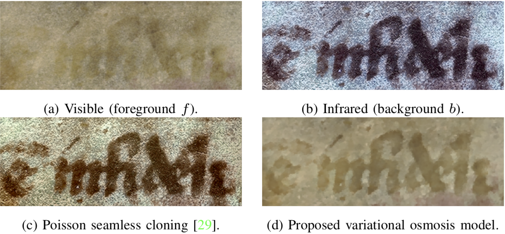

# Variational Osmosis for Non-Linear Image Fusion

 

**Author**: Simone Parisotto

**Other Authors** 
Luca Calatroni
Aurélie Bugeau
Nicolas Papadakis
Carola-Bibiane Schönlieb

**Version 1.0**

**Date: 04/10/2019**

This is a companion software for the [paper](https://ieeexplore.ieee.org/document/9052752):

```
@article{ParCalBogPapSch19,
 author  = {Parisotto, S. Calatroni, L. Bugeau, A. Papadakis, N. and Schönlieb, C.-B.} ,
 title   = {{Variational Osmosis for Non-Linear Image Fusion}},
 journal = {{IEEE Transactions on Image Processing}}, 
 title   = {{Variational Osmosis for Non-Linear Image Fusion}}, 
 year    = {2020},
 volume  = {29},
 pages   = {5507-5516},
 doi     = {10.1109/TIP.2020.2983537},
 ISSN    = {1941-0042},
}
```

### License
[BSD 3-Clause License](https://opensource.org/licenses/BSD-3-Clause)
